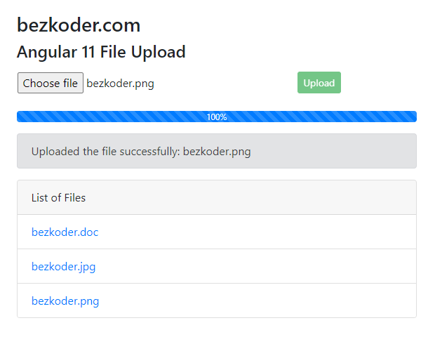

# Angular 11 File upload example with Progress bar

In this tutorial, I will show you way to build an Angular 11 File upload example using Bootstrap, FormData and Progress Bar.

For more detail, please visit:
> [Angular 11 File upload example with Progress bar & Bootstrap](https://bezkoder.com/angular-11-file-upload/)

Rest APIs server for this Angular Client:
> [Node.js Express File Upload Rest API example](https://bezkoder.com/node-js-express-file-upload/)

> [Node.js Express File Upload with Google Cloud Storage example](https://bezkoder.com/google-cloud-storage-nodejs-upload-file/)

> [Spring Boot Multipart File upload (to static folder) example](https://bezkoder.com/spring-boot-file-upload/)

> [Spring Boot Multipart File upload (to database) example](https://bezkoder.com/spring-boot-upload-file-database/)

More practice:
> [Angular 11 Upload File to Firebase Storage example](https://bezkoder.com/angular-11-file-upload-firebase-storage/)

> [Angular 11 JWT Authentication example with Web Api](https://bezkoder.com/angular-11-jwt-auth/)

> [Angular 11 CRUD Application example with Web API](https://bezkoder.com/angular-11-crud-app/)

> [Angular 11 Pagination example using ngx-pagination](https://bezkoder.com/angular-11-pagination-ngx/)

Fullstack with Node.js Express:
> [Angular 11 + Node.js Express + MySQL](https://bezkoder.com/angular-11-node-js-express-mysql/)

> [Angular 11 + Node.js Express + PostgreSQL](https://bezkoder.com/angular-11-node-js-express-postgresql/)

> [Angular 11 + Node.js Express + MongoDB](https://bezkoder.com/angular-11-mongodb-node-js-express/)

> [Angular 11 + Node.js Express: JWT Authentication & Authorization example](https://bezkoder.com/node-js-angular-11-jwt-authentication/)

Fullstack with Spring Boot:
> [Angular 11 + Spring Boot + MySQL](https://bezkoder.com/angular-11-spring-boot-crud/)

> [Angular 11 + Spring Boot + PostgreSQL](https://bezkoder.com/angular-11-spring-boot-postgresql/)

> [Angular 11 + Spring Boot + MongoDB](https://bezkoder.com/angular-11-spring-boot-mongodb/)

> [Angular 11 + Spring Boot: File upload example](https://bezkoder.com/angular-11-spring-boot-file-upload/)

> [Angular 11 + Spring Boot: JWT Authentication & Authorization example](https://bezkoder.com/angular-11-spring-boot-jwt-auth/)

Fullstack with Django:
> [Angular 11 + Django Rest Framework](https://bezkoder.com/django-angular-11-crud-rest-framework/)

> [Angular 11 + Django + MySQL](https://bezkoder.com/django-angular-mysql/)

> [Angular 11 + Django + PostgreSQL](https://bezkoder.com/django-angular-postgresql/)

Serverless with Firebase:
> [Angular 11 Firebase CRUD Realtime DB | AngularFireDatabase](https://bezkoder.com/angular-11-firebase-crud/)

> [Angular 11 Firestore CRUD | AngularFireStore](https://bezkoder.com/angular-11-firestore-crud-angularfirestore/)

> [Angular 11 Upload File to Firebase Storage example](https://bezkoder.com/angular-11-file-upload-firebase-storage/)

Integration (run back-end & front-end on same server/port)
> [How to Integrate Angular with Node.js Restful Services](https://bezkoder.com/integrate-angular-10-node-js/)

> [How to Integrate Angular with Spring Boot Rest API](https://bezkoder.com/integrate-angular-11-spring-boot/)

## Development server

Run `ng serve --port 8081` for a dev server. Navigate to `http://localhost:8081/`. The app will automatically reload if you change any of the source files.

## Code scaffolding

Run `ng generate component component-name` to generate a new component. You can also use `ng generate directive|pipe|service|class|guard|interface|enum|module`.

## Build

Run `ng build` to build the project. The build artifacts will be stored in the `dist/` directory. Use the `--prod` flag for a production build.

## Running unit tests

Run `ng test` to execute the unit tests via [Karma](https://karma-runner.github.io).

## Running end-to-end tests

Run `ng e2e` to execute the end-to-end tests via [Protractor](http://www.protractortest.org/).

## Further help

To get more help on the Angular CLI use `ng help` or go check out the [Angular CLI README](https://github.com/angular/angular-cli/blob/master/README.md).
